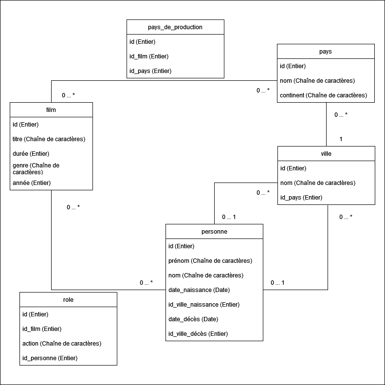
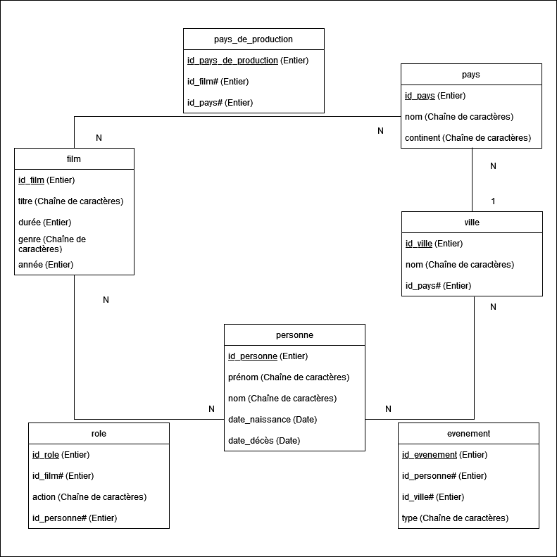

# Support pour apprendre le SQL à partir d'un exemple de base de données

La base de données exemple_films a été créée avec le SQLite à partir de données prélevées sur Wikipedia.

Elle répond au modèle conceptuel suivant :

Ce modèle permet de créer un modèle logique relationnel à l'origine de son implantation physique dans SQLite

